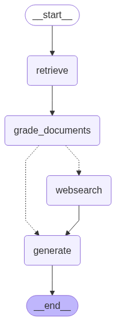
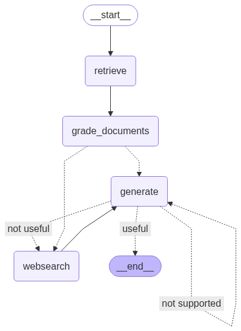

# Agentic RAG Systems with LangGraph

A collection of intelligent Retrieval-Augmented Generation (RAG) systems built with [LangGraph](https://github.com/langgraph-dev/langgraph) demonstrating different architectural patterns for building testable, production-ready AI agents.

## 🎯 Overview

This repository showcases two distinct approaches to building RAG systems using LangGraph's powerful state-based workflow capabilities:

1. **Agentic RAG** (`agentic_rag/`) - A foundational implementation with document retrieval and web search fallback
2. **Self-RAG** (`self_rag/`) - An advanced system with self-reflection and quality assurance mechanisms

Both implementations leverage LangGraph's graph-based architecture to create modular, testable, and maintainable AI agents.

## 🏗️ LangGraph Architecture Benefits

### State-Based Workflow Management
LangGraph provides a robust framework for managing complex agent workflows through:
- **Typed State Objects**: Strongly typed state management with Pydantic models
- **Node-Based Architecture**: Modular components that can be independently tested and maintained
- **Conditional Routing**: Dynamic decision-making based on intermediate results
- **Error Handling**: Built-in mechanisms for handling failures and retries

### Testability and Modularity
Each system is designed with testability as a core principle:
- **Independent Chains**: LLM chains are isolated and independently testable
- **Mocked Dependencies**: External services can be easily mocked for testing
- **Unit Test Coverage**: Comprehensive test suites for all critical components
- **Deterministic Flows**: Predictable execution paths for reliable testing

## 📊 System Architectures

### Agentic RAG System


The agentic RAG system implements a straightforward but effective workflow:
- Document retrieval with relevance grading
- Fallback to web search when documents are insufficient
- Final answer generation with context

### Self-RAG System


The self-reflective RAG system adds quality assurance layers:
- Multi-stage document and answer evaluation
- Hallucination detection mechanisms
- Answer quality assessment
- Self-correction and re-generation capabilities

## 🔄 Workflow Patterns

### Conditional Routing
Both systems demonstrate sophisticated routing logic:

```python
# Example from graph.py
def decide_to_generate(state):
    filtered_docs = state["documents"]
    if not filtered_docs:
        return "websearch"
    else:
        return "generate"
```

### State Management
Centralized state tracking with typed objects:

```python
class GraphState(TypedDict):
    question: str
    generation: str
    documents: List[str]
    # Additional state fields...
```

### Chain Integration
Modular LLM chains for specific tasks:
- **Retrieval Grading**: Evaluates document relevance
- **Generation**: Creates comprehensive answers
- **Hallucination Detection**: Validates factual accuracy (Self-RAG)
- **Answer Quality**: Assesses response adequacy (Self-RAG)

## 🧪 Testing Philosophy

Both systems emphasize comprehensive testing:

### Chain-Level Testing
- Individual LLM chains tested in isolation
- Mocked responses for deterministic testing
- Edge case handling verification

### Integration Testing
- End-to-end workflow validation
- State transitions verification
- Error propagation testing

### Mock-Based Testing
External dependencies (OpenAI, Tavily) are mocked to ensure:
- Fast test execution
- Reliable CI/CD pipelines
- Predictable test outcomes

## 🚀 Key Features

### Agentic RAG (`agentic_rag/`)
- Document retrieval with ChromaDB
- LLM-based document grading
- Web search fallback mechanism
- Clean, understandable workflow

### Self-RAG (`self_rag/`)
- All Agentic RAG features plus:
- Hallucination detection
- Answer quality assessment  
- Self-correction mechanisms
- Multi-iteration refinement

## 📁 Repository Structure

```
agentic-rag/
├── agentic_rag/                    # Agentic RAG implementation
│   ├── graph/
│   │   ├── chains/                 # LLM chains
│   │   ├── nodes/                  # Workflow nodes
│   │   ├── graph.py               # Main workflow
│   │   └── state.py               # State management
│   ├── main.py                    # Entry point
│   └── README.md                  # Detailed documentation
├── self_rag/                      # Self-reflective RAG implementation
│   ├── graph/
│   │   ├── chains/                # Enhanced LLM chains
│   │   ├── nodes/                 # Extended workflow nodes
│   │   ├── graph.py              # Self-reflective workflow
│   │   └── state.py              # Enhanced state management
│   ├── main.py                   # Entry point
│   └── README.md                 # Detailed documentation
├── requirements.txt              # Shared dependencies
├── graph-agentic.png             # Agentic RAG workflow diagram
├── graph-self.png              # Self-RAG workflow diagram
└── README.md                   # This overview
```

## 🔧 LangGraph Implementation Highlights

### Node Definition Pattern
```python
from langgraph.graph import StateGraph

def create_graph():
    workflow = StateGraph(GraphState)
    
    workflow.add_node("retrieve", retrieve)
    workflow.add_node("grade_documents", grade_documents)
    workflow.add_node("generate", generate)
    workflow.add_node("websearch", web_search)
    
    workflow.add_conditional_edges(
        "grade_documents",
        decide_to_generate,
        {
            "websearch": "websearch",
            "generate": "generate",
        },
    )
    
    return workflow.compile()
```

### Testable Architecture
Each component is independently testable:
- Nodes can be tested with mock state objects
- Chains can be tested with sample inputs
- Decision functions can be tested with various state conditions

## 🎓 Learning Outcomes

This repository demonstrates:
- **Production-Ready Patterns**: How to structure LangGraph applications for maintainability
- **Testing Strategies**: Comprehensive testing approaches for AI agents
- **Architectural Evolution**: Progression from simple to advanced RAG systems
- **State Management**: Effective patterns for managing complex agent state
- **Error Handling**: Robust error handling and recovery mechanisms

## 🚀 Getting Started

Each subdirectory contains its own detailed README with specific setup and usage instructions:
- [`agentic_rag/README.md`](agentic_rag/README.md) - Agentic RAG system
- [`self_rag/README.md`](self_rag/README.md) - Self-reflective RAG system

Both systems share the same dependencies defined in [`requirements.txt`](requirements.txt) and follow similar setup procedures with environment configuration and data ingestion steps.