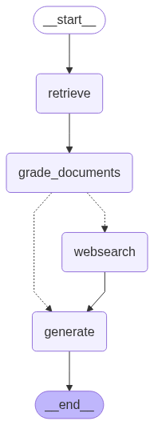

# Agentic RAG

This repository implements an agentic Retrieval-Augmented Generation (RAG) system using [LangGraph](https://github.com/langgraph-dev/langgraph). The system is designed to answer questions based on retrieved documents, incorporating web search when necessary.

## Overview

The core of this project is a graph-based workflow defined using LangGraph. This graph consists of several nodes, each performing a specific task, and edges that define the flow of information between these nodes. The figure below illustrates the structure of this graph.



## Nodes

The graph consists of the following nodes:

*   **Retrieve:** This node, implemented in [src/graph/nodes/retrieve.py](src/graph/nodes/retrieve.py), is responsible for retrieving relevant documents from a vector store ([Chroma](https://www.trychroma.com/)). It uses the question from the graph state to query the vector store and returns a set of relevant documents. The vector store is populated using the [src/ingestion.py](src/ingestion.py) script, which loads content from specified URLs, splits it into chunks, and stores it in the Chroma vector store.
*   **Grade Documents:** Implemented in [src/graph/nodes/grade_documents.py](src/graph/nodes/grade_documents.py), this node assesses the relevance of the retrieved documents to the user's question. It uses the [`retrieval_grader`](src/graph/chains/retrieval_grader.py) chain (defined in [src/graph/chains/retrieval_grader.py](src/graph/chains/retrieval_grader.py)) to determine if the documents are relevant.
*   **Web Search:** This node, implemented in [src/graph/nodes/web_search.py](src/graph/nodes/web_search.py), performs a web search using the Tavily API if the retrieved documents are deemed insufficient. It takes the question from the graph state and uses it as a query for the Tavily search engine. The search results are then added to the list of documents.
*   **Generate:** Implemented in [src/graph/nodes/generate.py](src/graph/nodes/generate.py), this node generates an answer to the question based on the retrieved documents. It uses the [`generation_chain`](src/graph/chains/generation.py) (defined in [src/graph/chains/generation.py](src/graph/chains/generation.py)) to generate the answer.

## Graph

The graph is defined in [src/graph/graph.py](src/graph/graph.py) using LangGraph's `StateGraph` API. The graph's structure is as follows:

1.  The workflow starts at the `RETRIEVE` node.
2.  The retrieved documents are passed to the `GRADE_DOCUMENTS` node.
3.  A conditional edge determines whether to proceed to the `WEBSEARCH` node or the `GENERATE` node, based on the relevance of the retrieved documents. The `decide_to_generate` function in [src/graph/graph.py](src/graph/graph.py) makes this decision.
4.  If the `WEBSEARCH` node is selected, the web search results are added to the documents, and the combined documents are passed to the `GENERATE` node.
5.  If the `GENERATE` node is selected directly, the retrieved documents are used to generate the answer.
6.  The generated answer is the final output of the graph.

The graph's state is managed by the `GraphState` class, defined in [src/graph/state.py](src/graph/state.py). This class stores the question, the retrieved documents, the web search results, and the generated answer.

## Chains

The project uses two main Langchain Expression Language (LCEL) chains:

*   **Retrieval Grader Chain:** This chain, defined in [src/graph/chains/retrieval_grader.py](src/graph/chains/retrieval_grader.py), is responsible for grading the relevance of retrieved documents. It uses a ChatOpenAI model to determine if a document is relevant to the question. The chain outputs a `GradeDocuments` object, which contains a binary score ('yes' or 'no') indicating the relevance of the document.
*   **Generation Chain:** This chain, defined in [src/graph/chains/generation.py](src/graph/chains/generation.py), is responsible for generating an answer to the question based on the retrieved documents. It uses a ChatOpenAI model and a RAG prompt from the LangChain Hub to generate the answer.

## Environment Variables

The project requires the following environment variables to be set:

*   `OPENAI_API_KEY`: Your OpenAI API key.
*   `TAVILY_API_KEY`: Your Tavily API key.
*   `LANGCHAIN_TRACING`: Enable Langchain tracing.
*   `LANGCHAIN_ENDPOINT`: Langchain endpoint.
*   `LANGCHAIN_API_KEY`: Langchain API key.
*   `LANGCHAIN_PROJECT`: Langchain project name.

These variables can be set in the `.env` file in the `src/` directory.  A sample `.env` file is provided in [src/.env](src/.env).

## Usage

1.  Install the required packages:

    ```bash
    pip install -r requirements.txt
    ```

2.  Run the ingestion script to populate the vector store:

    ```bash
    python src/ingestion.py
    ```

3.  Run the main script to ask a question:

    ```bash
    python src/main.py
    ```

This will print the answer to the question "What is agent memory?".

## Testing

The project includes unit tests for the chains in [src/graph/chains/tests/test_chains.py](src/graph/chains/tests/test_chains.py). To run