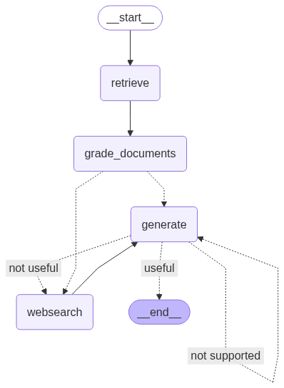

# Self-RAG (Self-Reflective Retrieval-Augmented Generation)

An intelligent Self-Reflective RAG system built with [LangGraph](https://github.com/langgraph-dev/langgraph) that implements self-correction and hallucination detection for more reliable question answering.

## ✨ Features

- **Smart Document Retrieval**: Uses ChromaDB vector store for efficient similarity search
- **Self-Reflective Generation**: Implements reflection and self-correction mechanisms
- **Hallucination Detection**: Evaluates generated answers for factual accuracy
- **Answer Quality Grading**: Assesses answer relevance and usefulness
- **Adaptive Workflow**: Routes between retrieval, web search, and re-generation based on quality assessments
- **LangGraph Implementation**: Robust state-based graph workflow with decision points
- **OpenAI Integration**: Leverages OpenAI models for generation and grading
- **Comprehensive Testing**: Includes unit tests for all chain components

## 🏗️ Architecture



The system implements a sophisticated self-reflective workflow with multiple quality gates:

### 🔍 Retrieve Node
- **Location**: `graph/nodes/retrieve.py`
- **Function**: Queries ChromaDB vector store using OpenAI embeddings
- **Input**: User question from graph state
- **Output**: Relevant document chunks

### 📊 Grade Documents Node
- **Location**: `graph/nodes/grade_documents.py`
- **Function**: Evaluates document relevance using LLM-based grading
- **Chain**: Uses `retrieval_grader` chain (`graph/chains/retrieval_grader.py`)
- **Output**: Binary relevance scores for each document

### 🌐 Web Search Node
- **Location**: `graph/nodes/web_search.py`
- **Function**: Performs web search using Tavily API when documents are insufficient
- **Trigger**: Activated when retrieved documents are deemed irrelevant
- **Integration**: Seamlessly adds web results to document pool

### 🤖 Generate Node
- **Location**: `graph/nodes/generate.py`
- **Function**: Generates comprehensive answers using retrieved and/or web-sourced content
- **Chain**: Uses `generation_chain` (`graph/chains/generation.py`)
- **Model**: OpenAI ChatGPT with specialized RAG prompting

### 🔍 Hallucination Grader
- **Location**: `graph/chains/hallucination_grader.py`
- **Function**: Evaluates whether generated answers are grounded in the provided documents
- **Purpose**: Detects hallucinations and factual inconsistencies
- **Output**: Binary score indicating factual grounding

### 📝 Answer Grader
- **Location**: `graph/chains/answer_grader.py`
- **Function**: Assesses answer quality, relevance, and usefulness
- **Purpose**: Determines if the answer adequately addresses the question
- **Output**: Binary score for answer quality

## 🔄 Workflow Logic

1. **Start** → `RETRIEVE` node queries vector store
2. **Document Grading** → `GRADE_DOCUMENTS` evaluates document relevance
3. **Generation Decision**:
   - **Sufficient documents** → Proceed to `GENERATE`
   - **Insufficient documents** → Route to `WEBSEARCH` then `GENERATE`
4. **Quality Assessment** → Generated answer undergoes dual evaluation:
   - **Hallucination Check**: Verify factual grounding
   - **Answer Quality Check**: Assess relevance and usefulness
5. **Self-Correction Decision**:
   - **High quality & factual** → Return answer
   - **Hallucinated or poor quality** → Re-generate or search for better sources
6. **End** → Return final validated answer

The decision logic is handled by multiple decision functions in `graph/graph.py`.

## 📊 State Management

The workflow state is managed by `GraphState` class (`graph/state.py`) which tracks:
- User question
- Retrieved documents
- Web search results
- Generated answer
- Document grading results
- Hallucination detection results
- Answer quality scores
- Generation iteration count

## 🛠️ Setup & Installation

### Prerequisites
- Python 3.8+
- OpenAI API key
- Tavily API key (for web search)

### Installation

1. **Clone and navigate to the project:**
   ```bash
   git clone <repository-url>
   cd agentic-rag/self_rag
   ```

2. **Install dependencies:**
   ```bash
   pip install -r ../requirements.txt
   ```

3. **Configure environment variables:**
   Create a `.env` file in the project directory:
   ```bash
   OPENAI_API_KEY=your_openai_api_key
   TAVILY_API_KEY=your_tavily_api_key
   
   # Optional: LangSmith tracing
   LANGCHAIN_TRACING_V2=true
   LANGCHAIN_ENDPOINT=https://api.smith.langchain.com
   LANGCHAIN_API_KEY=your_langsmith_key
   LANGCHAIN_PROJECT=self-rag
   ```

### Data Ingestion

**Populate the vector store with documents:**
```bash
python ingestion.py
```

This script:
- Loads content from predefined URLs (Lilian Weng's blog posts on AI agents)
- Splits documents into 250-token chunks
- Creates ChromaDB vector store with OpenAI embeddings
- Persists data in `./.chroma` directory

## 🚀 Usage

### Demo Mode
Run the system with a default question:
```bash
python main.py --demo
```
This will run the self-reflective agent with the question "What is agent memory?".

### Question Mode
Run the system with a specific question provided as a command-line argument:
```bash
python main.py --question "What is prompt engineering?"
```
This will run the agent with the specified question.

## 🧪 Testing

Run the comprehensive test suite:
```bash
pytest graph/chains/tests/test_chains.py -v
```

Tests cover:
- Retrieval grader functionality
- Generation chain behavior
- Hallucination detection
- Answer quality assessment
- Chain integration with various inputs

## 📁 Project Structure

```
self_rag/
├── graph/
│   ├── chains/
│   │   ├── generation.py           # Answer generation chain
│   │   ├── retrieval_grader.py     # Document relevance grader
│   │   ├── hallucination_grader.py # Hallucination detection
│   │   ├── answer_grader.py        # Answer quality assessment
│   │   └── tests/
│   │       └── test_chains.py      # Unit tests
│   ├── nodes/
│   │   ├── generate.py             # Generation node
│   │   ├── grade_documents.py      # Document grading node  
│   │   ├── retrieve.py             # Retrieval node
│   │   └── web_search.py           # Web search node
│   ├── consts.py                   # Node name constants
│   ├── graph.py                    # Main workflow definition
│   └── state.py                    # State management
├── ingestion.py                    # Data ingestion script
├── main.py                         # Entry point
├── README.md                       # This file
├── graph.png                       # Workflow visualization
└── .env                            # Environment variables
```

## 🔄 Self-Reflection Mechanisms

### Hallucination Detection
The system uses an LLM-based hallucination grader to verify that generated answers are factually grounded in the source documents. If hallucinations are detected, the system can trigger re-generation or additional retrieval.

### Answer Quality Assessment
A dedicated answer grader evaluates whether the generated response adequately addresses the user's question. Poor quality answers trigger workflow adjustments to improve the final output.

### Adaptive Routing
Based on quality assessments, the system dynamically routes between:
- Additional document retrieval
- Web search for more sources
- Answer re-generation
- Final answer delivery

This self-reflective approach ensures higher quality, more reliable responses compared to traditional RAG systems.